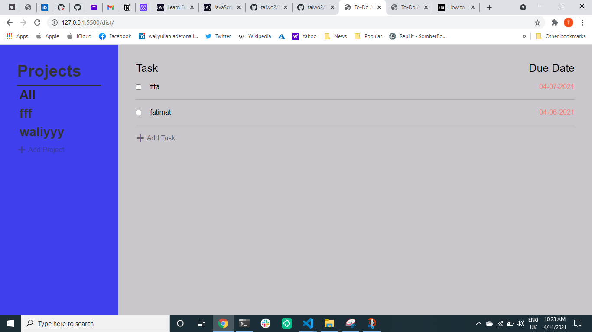

# Todo app

> Todo list is a simple project for keeping track of your Todo's for different projects. by using this app you can create a new project and you can add your todos in specific project of your choice.

## Features
 User can :
 - Create a new project
 - Create a new to do to the specific project
 - Update the todo
 - Delete the todo

## Built with
- Javascript
- Webpack
- HTML
- Css
- Local storage

## Getting Started

- Clone the repo `https://github.com/taiwo2/Todo-app.git`
- cd `into` the project
- Run `git pull origin Todo-app`
- Run `yarn install` or `npm install` to install dependencies
- On the terminal run `npm run start` open up the live server

## Authors

👤 Taiwo Adetona

- Github: [@taiwo2](https://github.com/taiwo2)

- LinkedIn: [Taiwo Adetona](https://www.linkedin.com/in/taiwo-adetona/)

- Twitter: [@TaiwoAdetona4](https://twitter.com/TaiwoAdetona4/)

## 🤝 Contributing

Contributions, issues and feature requests are welcome!

Feel free to check the [issues page](issues/).

## Show your support

Give a ⭐️ if you like this project!

## 📝 License

MIT License